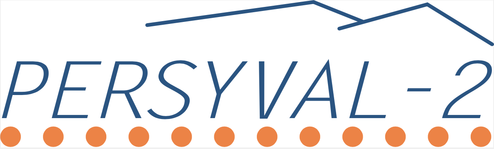
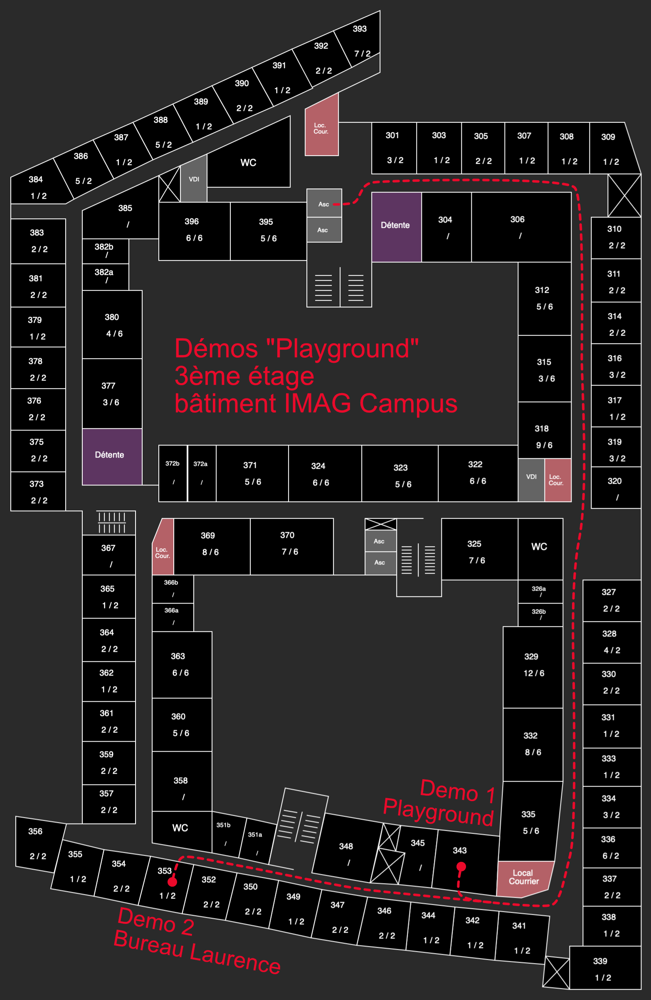
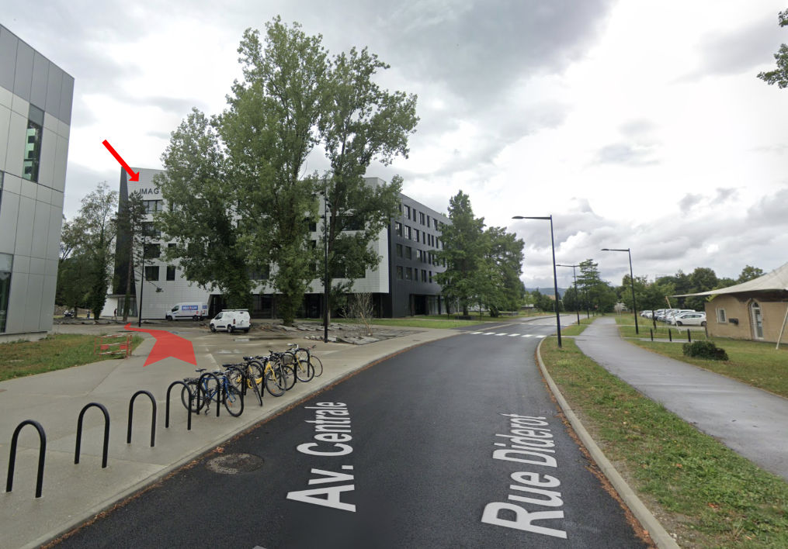

# Journées CONTINUUM 2023

Les pages suivantes regroupent les informations des journées annuelles de l'ÉQUIPEX + CONTINUUM, qui auront lieu du **3 au 4 Juillet 2023**.

## Informations générales
Les journées de l'Équipex + CONTINUUM sont l'occasion pour les personnels y contribuant de se voir en 'présentiel' pour échanger au sein des comités et autour de projets transverses.
Les activités proposées durant ces journées seront les suivantes:

- Présentations d'activités grenobloises (équipe action MANIP soutenue par PERSYVAL et institut MIAI) et de CONTINUUM durant un séminaire croisé
- Visites des plateformes Grenobloises
- Retours des différents comités

Ces journées ont reçu le soutien d'Inria, et de PERSYVAL.

## Programme détaillé

### Lundi 3 Juillet

#### 9h30-10h
- Accueil des personnels autour d'une boisson chaude

#### 10h-12h
- Séminaire ouvert de présentations de CONTINUUM et d'activités grenobloises soutenues par PERSYVAL

#### 12h-13h30
- Buffet repas (PERSYVAL & CONTINUUM)

#### 13h30-14h
- Départ en bus pour la plateforme KINOVIS

#### 14h-16h30
3 ateliers par permutation circulaire (groupe de dix personnels, 45 minutes par atelier)
- Visite de la plateforme KINOVIS
- Atelier Thématique 1 (Quelle(s) démonstrations pour CONTINUUM)
- Atelier Thématique 2 (Classification des plateformes CONTINUUM)

#### 16H30-17H30
- Session plénière d'un des comités de CONTINUUM (ordre non défini actuellement)

#### 17h30-18h
- Retour en bus au laboratoire G-SCOP

#### Soirée
- Repas dans un restaurant (à vos frais malheureusement :))

### Mardi 4 Juillet
La matinée du mardi 4 Juillet sera divisée en deux: un groupe commencera par une visite de la plateforme Playground au LIG tandis que le second commencera par la visite de VISION-R à G-SCOP.
#### Groupe 1 
- 8h-9h30: Visite de la plateforme VISION-R
- 9h30-10h: Déplacement vers le LIG en tramway
- 10h-11h30: Visite de la plateforme PLAYGROUND
- 11h30-12h: Retour à G-SCOP

#### Groupe 2
- 8h-8h30: Déplacement vers le LIG en tramway
- 8h30-10h: Visite de la plateforme PLAYGROUND
- 10h- 10h30 Retour à G-SCOP
- 10h30-12: Visite de la plateforme VISION-R

#### 12h-13h30
- Buffet repas

#### 13h30-14h30
- Session plénière d'un des comités de CONTINUUM (ordre non défini actuellement)

#### 15h-16h
- Session plénière d'un des comités de CONTINUUM (ordre non défini actuellement)

#### 16h-16h30 
- Clôture des journées

Note: le planning est probablement amené à changer dans les jours à venir, afin de mieux adapter les temps de visites, les pauses café et la clôture des journées

## Planning prévisionnel

- ce planning est susceptible d'évoluer dans les jours qui viennent, vous serez notifiés de sa version définitive.

<iframe src="https://docs.google.com/spreadsheets/d/e/2PACX-1vT810goexIiolrXO6onsGpU8Se3RuHXZyA-oncCAfrP0SfBYtPDX_CKobxCEZ7vfOu7SZaWS2Kc1Z8e/pubhtml?gid=0&amp;single=true&amp;widget=true&amp;headers=false" width="700" height="700"></iframe>

## Comment venir
Les sessions plénières se dérouleront au laboratoire G-SCOP, à côté de la gare de Grenoble.

Les titres de transport peuvent s'acheter ici: [https://www.tag.fr/67-un-tarif-pour-chacun.htm](https://www.tag.fr/67-un-tarif-pour-chacun.htm)

### Laboratoire G-SCOP
G-SCOP se trouve au 46, Avenue Félix VIALLET, à côté de la gare.

### Plateforme INRIA KINOVIS
Le centre INRIA de l'UGA se trouve au 655, Avenue de l'Europe à 38330 Montbonnot-Saint-Martin.
Un bus sera mis à disposition lundi pour nous y transporter.

### Plateforme Playground LIG
La plateforme Playground est accessible depuis le centre-ville via le tramway B.
Pour les visites du mardi matin, il faut compter 25 minutes de trajet.

Le plan ci-dessous indique les bureaux des différentes démonstrations:

### Aller au LIG depuis G-SCOP

[plan google](https://www.google.com/maps/dir/45.190655,5.7175935/45.1909338,5.7669779/@45.1931553,5.7203254,14z/data=!3m1!4b1!4m6!4m5!2m3!6e0!7e2!8j1688457600!3e3?authuser=0&entry=ttu)

* Sortir sur l'avenue Félix Viallet, partir à droite vers la gare
* À l'arrêt "Gare", prendre le tramway ***ligne B*** direction "Gières, plaine des sports" (attention, la ligne A passe aussi par cet arrêt).
* Descendre à l'arrêt "Gabriel Fauré"
* Suivre la ligne de tramway puis tourner à droite sur la première rue ("rue des Mathématiques" qui devient "avenue centrale"), marcher vers le bâtiment IMAG : gros bâtiment blanc et noir, IMAG est visible en haut.

## Aller à G-SCOP depuis le LIG

Faire le trajet inverse :-) Ligne B direction "Grenoble, Oxford"
