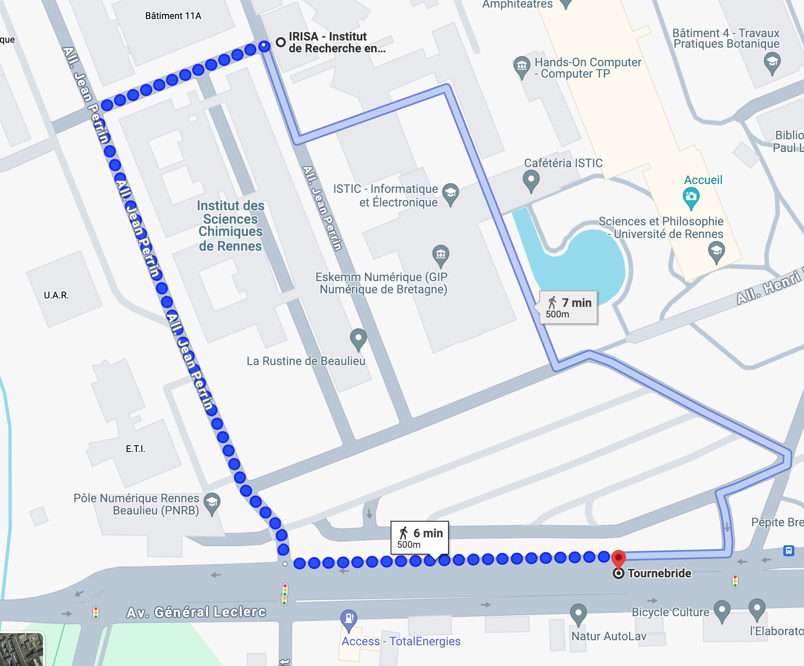

# Journées CONTINUUM 2024

Les pages suivantes regroupent les informations des journées annuelles de l'EquipEx+ CONTINUUM, et de la journée scientifique co-animée avec le Groupe de Travail "Réalités Virtuelles" (GT RV) du GdR IG-RV, qui auront lieu du **24 au 26 Juin 2024** au Centre Inria de l'Université de Rennes/IRISA.

La journée est gratuite, mais sur inscription avant le 17 Juin 2024 -> [(lien d'inscription)](https://evento.renater.fr/survey/journees-continuum-2024-du-24-au-26-juin-rennes-y7hlpzv6)

Pour information, les déjeuneurs sont pris en charge par les organisateurs, les dîners ne les sont pas, mais des lieux seront conseillés.    

## Informations générales

Les journées de l'ÉquipEx+ CONTINUUM et du GT RV sont l'occasion pour les personnels y contribuant de se voir en «présentiel» pour échanger au sein des comités et autour de projets transverses. 

Cette année, le premier jour serait dédié à une journée scientifique coanimé par CONTINUUM et le GT RV.

Les activités proposées durant ces journées seront les suivantes :

- Présentations scientifiques animées par CONTINUUM et le GT RV.
- Présentations d'activités Rennaises (équipes MimeTIC, Hybrid, Virtus, Rainbow) et de CONTINUUM.
- Présentation de Anne-Laure GUINET, qui a reçu un accessit au prix de thèse du GdR IG-RV en 2023 pour sa thèse intitulée "Retours sensoriels multimodaux en réalité augmentée pour la rééducation de la marche des enfants atteints de paralysie cérébrale"
- Visites des plateformes Rennaises (Immersia et Immermove)
- Retours et réunions des différents comités

## Programme détaillé

Note : le planning est probablement amené à changer dans les jours à venir, afin de mieux adapter les temps de visites, les pauses café et la clôture des journées

### Lundi 24 Juin

- 12h00-13h30 - Accueil Journée Scientifique CONTINUUM/GT RV
- 13h30-14h00 - Introduction Journée Scientifique
- 14h00-15h30 - Présentations Scientifiques
- 15h30-16h00 - Pause café
- 16h00-17h00 - Présentations Scientifiques
- 17h00-18h00 - Séminaire sur les Prospectives Scientifiques de nos thématiques de recherche (Réalité Virtuelle, Réalité Augmentée, Réalité Mixte)

#### Soirée
- Repas dans un restaurant (à vos frais malheureusement)

### Mardi 25 Juin

- 08h30-09h30 - Présentations Scientifiques / Accueil Journées CONTINUUM
- 09h30-10h00 - Pause café
- 10h00-10h30 - Introduction Journées CONTINUUM 
- 10h30-11h30 - Présentation des équipes de recherche du site Rennais (MimeTIC, Hybrid, Virtus, Rainbow).
- 11h30-12-00 - Présentation d'Anne-Laure GUINET, Accessit au prix de thèse du GdR IG-RV 2023 pour sa thèse doctorat intitulée "Retours sensoriels multimodaux en réalité augmentée pour la rééducation de la marche des enfants atteints de paralysie cérébrale"
- 12h00-13h30 - Buffet repas
- 13h30-15h30 - Visite plateforme Immersia et démos équipes
- 15h30-16h00 - Pause café
- 16h00-18h00 - Réunion CoTech et CoTrans

#### Soirée
- Repas dans un restaurant (à vos frais malheureusement)

### Mercredi 26 Juin

- 08h30 - Départ en car pour l'ENS/M2S
- 09h00-11h00 - Visite Immermove + demos.
- 11h00 - Départ en car pour l'Inria/IRISA
- 12h00-13h30 - Buffet repas
- 13h30-14h30 - Réunion CoScient
- 14h30-15h30 - Réunion ComEx
- 15h30 - Fin des journées

## Comment venir

Les sessions plénières se dérouleront au Centre Inria de l'Université de Rennes/IRISA. Vous trouverez ici les informations pour nous joindre :

- https://www.irisa.fr/localisez-nous-rennes
- https://www.inria.fr/fr/comment-venir-au-centre-inria-de-luniversite-de-rennes

Les tickets de métro et de bus rechargeables peuvent être achetés à la gare ou dans n'importe quelle station de métro. Possibilité de valider son titre de transport à la montée des bus avec la carte bancaire.

### Plateforme Immersia
La plateforme Immersia est située sur le Campus Universitaire de Beaulieu à côté de l'Inria Rennes/IRISA.

- https://www.irisa.fr/immersia/localisation/

### Plateforme Immermove

La plateforme Immermove est située sur le Campus de Ker Lann à Bruz á l'ENS/M2S.

- https://m2slab.com/facilities-4/

## Precisions on how to come

### Going from the center of Rennes to Inria/IRISA

- If the subway line B is down, it is easier to take the bus.
- The main hub in Rennes is **République** Station. It is from 10-15 minutes walking from the train station
    - Beware that this station is overcrowded the morning, as a lot of student are going to *Beaulieu* Campus :)
- From here you can take the C4 or C6 bus until **Tournebride** bus stop (depending on the traffic, 15-20 min).
    - For C4 Bus, the direction is **ZA Saint-Sulpice**
    - For C6 Bus, it is **Rigourdière**
- Tickets can be paid with your credit/debit card in the bus but (1.70€ for 1h travel).
- From the bus stop **Tournebride**, you will have 6 minutes until reaching Inria/IRISA (cf picture below)

### Going from Inria/IRISA to the center of Rennes

- The buses are still the best option :)