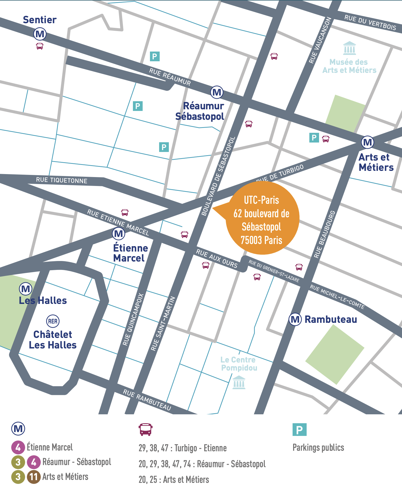

# Journée Scientifique 13 Mars 2024

Les pages suivantes regroupent les informations relatives à la journée scientifique CONTINUUM du 13 Mars 2024.

## Informations générales
Les environnements virtuels/ mixtes collaboratifs posent de nombreux défis qui peuvent etre liés à des aspects de manipulation d’objets 3D, de conception collaborative, de collaboration synchrone ou asynchrone, de communication entre avatars représentant les utilisateurs, de toucher pour la communication affectivo sociale entre avatars, de perception en environnement collaboratif, de fidélité des représentations, de challenges liés à la créativité, ou à la présence sociale, et enfin de formation à distance.

Cette journée de travail se veut à la fois académique et innovante. Pour cela chercheurs et start up seront présents afin de présenter leurs travaux et de réfléchir ensemble durant une table ronde. Une place importante sera faite aux discussions (pauses, déjeuner).

La journée est gratuite, sur [inscription](https://framaforms.org/journee-scientifique-continuum-13-mars-2024-1704983969) avant le 6 Mars 2024.

<iframe src="https://drive.google.com/file/d/16u-3JX15IIXh8PPWNt6WO4ES72IHgmLj/view?usp=sharing" width="700" height="700"></iframe>

## Programme détaillé

### 9h Accueil - café

### 9h30 Introduction sur l’Equipex CONTINUUM et ses objectifs scientifiques

*Présentations (format 20mn + 10mn discussion)*

### 9h40 “Bridging Time in XR: Asynchronous Collaboration Through Avatar Interactions”

- Intervenante : Anjela MAYER (PhD candidate, Karlsruhe Institute of Technology, Allemagne)

### 10h10 "Réinventer la relation Apprenant-Formateur à l'aune des Espaces Immersifs"

- Intervenante:  Anne Sophie Gimenez Directrice Widid 

### 10h40 Pause

### 11h00 « Communication en environnement virtuel par le toucher social entre agent et humain virtuel »

- Intervenant : Gregoire Richard (Post doc, UMR Heudiasyc, UTC)

### 11h30 « Retours sur la nouvelle stratégie européenne concernant les mondes virtuels »

- Intervenante : Valérie Riffaud Cangelosi Directrice ReapseConsulting, membre de RA Pro

### 11h50 Présentation de la table ronde de l’après midi 

### 12h Déjeuner

### 14h Présentation 5: Geoffrey GORISSE

### 14h30 Solène Neyret, chercheuse associée Univ. Strasbourg - ICUBE « Social interactions and self-representation in virtual reality »

### 15h00 Table ronde “Espaces de collaboration en environnement virtuel, nouveaux challenges et nouveaux appels à projets » - Modération par Jean Remi Chardonnet et Indira Thouvenin

### 16h30 Fin de la journée – (possibilité de rester plus tard pour ceux qui le souhaitent)

**Lieu : IMI UTC Paris 62 Bd de Sebastopol 75010 Paris Metro Les Halles, Etienne Marcel - RER A Chatelet**

Le dejeuner ne sera pas pris en charge par les organisateurs, mais de nombreux restaurants sont proches. Si les participants s’inscrivent assez tot, un restaurant sera réservé en priorité (le Zango). 

