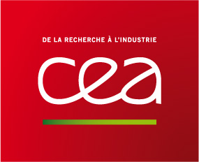
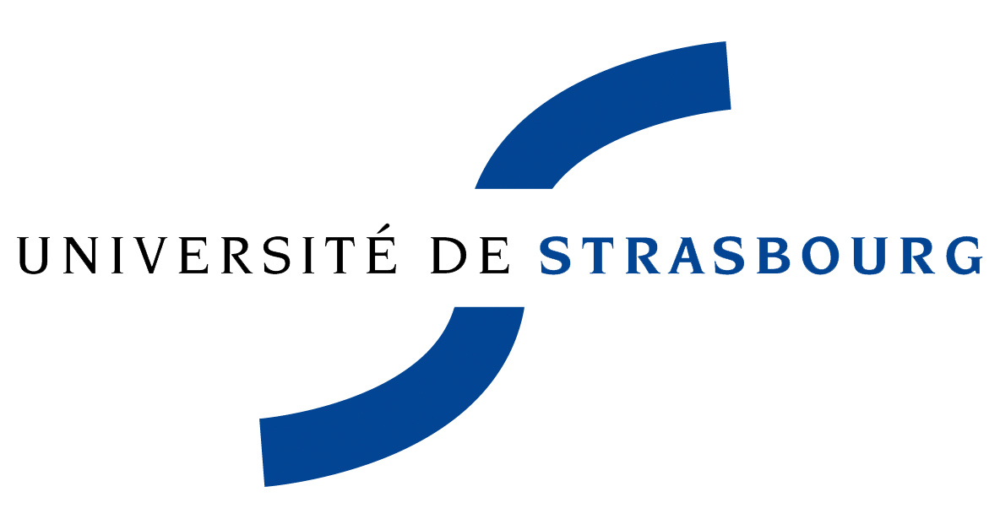
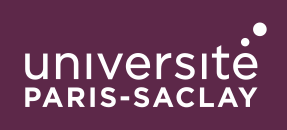
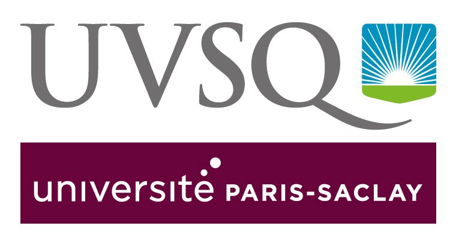
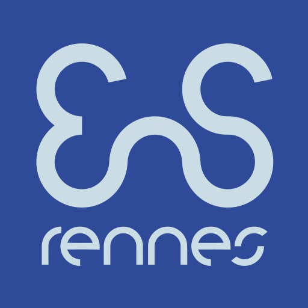
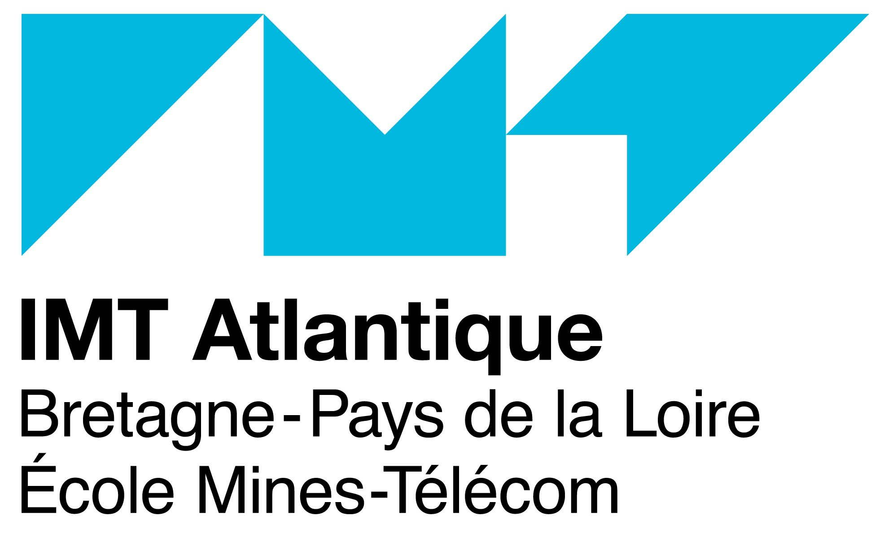
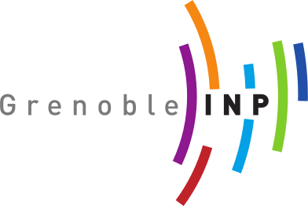
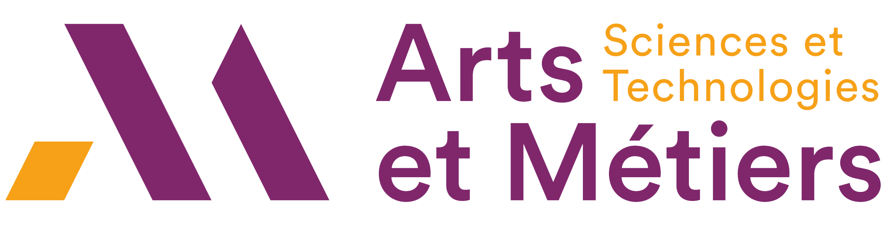
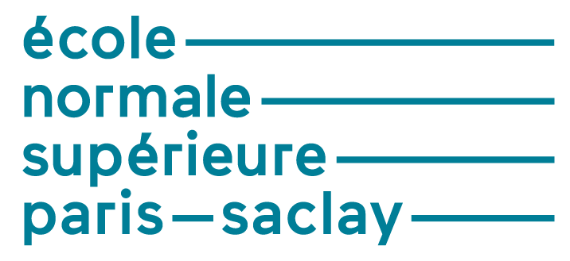
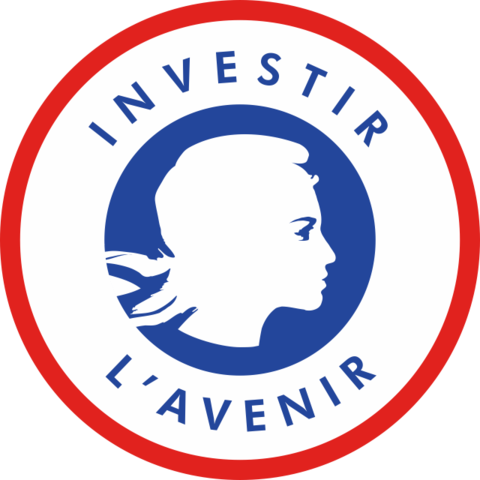

# EQUIPEX + CONTINUUM

## Présentation
CONTINUUM est un projet EquipEx+ porté par le CNRS dans le cadre du 4ème Programme d'investissements d'avenir (PIA4). Doté de 13,6M€, le projet créera une infrastructure de recherche collaborative de 30 plateformes situées dans toute la France, afin de faire progresser la recherche interdisciplinaire entre l'informatique et les sciences humaines et sociales. Grâce à CONTINUUM, 37 équipes de recherche développeront des recherches de pointe axées sur la visualisation, l'immersion, l'interaction et la collaboration, ainsi que sur la perception, la cognition et le comportement humains en réalité virtuelle/augmentée.

CONTINUUM permet un changement de paradigme dans notre façon de percevoir, interagir et collaborer avec les données numériques complexes et les mondes numériques en plaçant l'être humain au centre des flux de traitement de données. Le projet permettra aux scientifiques, ingénieurs et utilisateurs industriels de disposer d'un réseau de plates-formes de visualisation et d'immersion haute performance pour observer, manipuler, comprendre et partager des données numériques, des simulations multi-échelles et des expériences virtuelles ou augmentées. Toutes les plates-formes permettront la collaboration à distance et seront dotées d'équipements mobiles pouvant être prêtés aux utilisateurs pour faciliter l'accès à ces technologies.

CONTINUUM est organisé selon deux axes :

- Recherche interdisciplinaire sur l'interaction, en collaboration entre l'informatique et les sciences humaines et sociales, afin d'accroître les connaissances et les solutions en matière d'informatique centrée sur l'humain ;
- Déploiement d'outils et de services pour répondre aux besoins de nombreux domaines scientifiques en matière d'accès aux grandes données, aux simulations et aux expériences virtuelles/augmentées (mathématiques, physique, biologie, ingénierie, informatique, médecine, psychologie, didactique, histoire, archéologie, sociologie, etc. )

La large couverture géographique de CONTINUUM permettra la diffusion du savoir-faire au monde économique et social, en collaboration avec les acteurs du transfert d'innovation (SATT, Pôles de compétitivité, Instituts Carnot...). Des modèles économiques spécifiques seront développés afin de permettre l'accès aux équipements et à une expertise de pointe par les universitaires et les utilisateurs privés. Grâce à CONTINUUM, les équipes de recherche françaises pourront devenir leader de la recherche sur les environnements numériques et immersifs grâce à des plateformes interconnectées et un cadre scientifique multidisciplinaire centré sur l'humain.
CONTINUUM comble le chaînon manquant entre l'infrastructure numérique actuelle des centres de données et de calcul, d'une part, et l'intelligence et l'expertise humaines, d'autre part.

Nous avons besoin de l'intelligence collective humaine pour exploiter la puissance de calcul et apprivoiser le déluge de données. Plus qu'un simple « humain dans la boucle », nous avons besoin d'humains aux commandes, avec les outils appropriés pour exercer ce contrôle. Comme pour les sciences naturelles, nous avons besoin d'instruments scientifiques pour observer les phénomènes cachés dans les grands ensembles de données, mener des expériences et faire des découvertes. CONTINUUM est un instrument qui permet d'explorer le monde numérique : un macroscope numérique.

En développant l'instrument lui-même et en l'utilisant dans différents domaines d'application, CONTINUUM favorisera la recherche interdisciplinaire afin de mieux comprendre comment interagir avec le monde numérique et de permettre des avancées dans d'autres domaines des sciences et de l'ingénierie.

## Partenaires

### 3 organismes de recherche
-------------------------

Centre National de la Recherche Scientifique (porteur)

  
Commissariat à l'Énergie Atomique et aux Énergies Alternatives

  
Institut national de recherche en sciences et technologies du numérique

* * *

### 10 universités
--------------

Université de Rennes 1

Université de Rennes 2

Aix-Marseille University

Université de Technologie de Compiègne

  
Université de Lille

Université Grenoble Alpes

  
Université de Strasbourg

COMUE UBFC Université de Technologie Belfort Montbéliard

Université Paris-Saclay

Université de Versailles - Saint-Quentin

* * *

### 9 écoles
--------

Ecole Normale Supérieure de Rennes

Institut National des Sciences Appliquées de Rennes

Ecole Nationale d'Ingénieurs de Brest

 
Ecole Nationale Supérieure Mines-Télécom Atlantique Bretagne-Pays de la Loire

Institut National Polytechnique de Grenoble

Ecole Nationale Supérieure des Arts et Métiers

Télécom Paris - Institut Polytechnique de Paris

Ecole Normale Supérieure Paris-Saclay

CentraleSupélec

* * *

### Financement
-----------

 
Programme Investissements d'avenir

Agence Nationale de la Recherche

## Plateformes

<iframe src="https://www.google.com/maps/d/u/0/embed?mid=1_EMMTAn6U0qOsp6aAYbYYqCn3Z-RHXg&ehbc=2E312F" width="700" height="500"></iframe>

### Immersia
 

### Immermove
 

### autres
 
