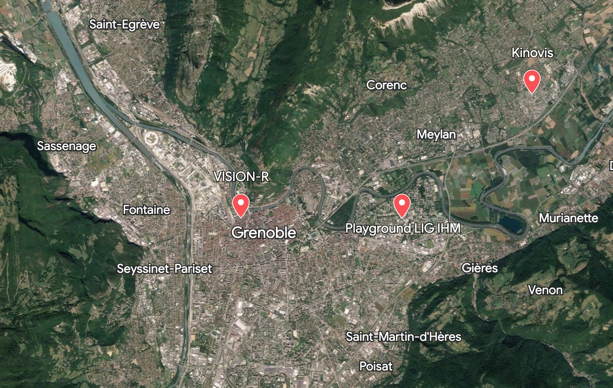

# Journées CONTINUUM 2023

Ce site regroupe les informations des journées annuelles de l'ÉQUIPEX + CONTINUUM, qui auront lieu du **3 au 4 Juillet 2023**.

## Informations générales
Les journées de l'Équipex + CONTINUUM sont l'occasion pour les personnels y contribuant de se voir en 'présentiel' pour échanger au sein des comités et autour de projets transverses.
Les activités proposées durant ces journées seront les suivantes:

- Visites des plateformes Grenobloises
- Retours des différents comités
- Présentations des activités autour de CONTINUUM de l'année passée

## Planning prévisionnel

- ce planning est susceptible d'évoluer dans les jours qui viennent, vous serez notifiés de sa version définitive.

<iframe src="https://docs.google.com/spreadsheets/d/e/2PACX-1vT810goexIiolrXO6onsGpU8Se3RuHXZyA-oncCAfrP0SfBYtPDX_CKobxCEZ7vfOu7SZaWS2Kc1Z8e/pubhtml?gid=0&amp;single=true&amp;widget=true&amp;headers=false" width="700" height="700"></iframe>

## Comment venir
Les sessions plénières se dérouleront au laboratoire G-SCOP, à côté de la gare de Grenoble.

### Laboratoire G-SCOP
G-SCOP se trouve au 46, Avenue Félix VIALLET, à côté de la gare.

### Plateforme INRIA KINOVIS
Le centre INRIA de l'UGA se trouve au 655, Avenue de l'Europe à 38330 Montbonnot-Saint-Martin.
Un bus sera mis à disposition lundi pour nous y transporter.

### Plateforme Playground LIG
La plateforme Playground est accessible depuis le centre-ville via le tramway B.
Pour les visites du mardi matin, il faut compter 25 minutes de trajet.

### Aller au LIG depuis G-SCOP

[plan google](https://www.google.com/maps/dir/45.190655,5.7175935/45.1909338,5.7669779/@45.1926294,5.7341401,15.52z/am=t/data=!4m2!4m1!3e3?authuser=0&entry=ttu)

* Sortir sur l'avenue Félix Viallet, partir à droite vers la gare
* À l'arrêt "Gare", prendre le tramway ***ligne B*** direction "Gières, plaine des sports" (attention, la ligne A passe aussi par cet arrêt).
* Descendre à l'arrêt "Gabriel Fauré"
* Suivre la ligne de tramway puis tourner à droite sur la première rue ("rue des Mathématiques" qui devient "avenue centrale"), marcher vers le bâtiment IMAG : gros bâtiment blanc et noir, IMAG est visible en haut.

## Aller à G-SCOP depuis le LIG

Faire le trajet inverse :-) Ligne B direction "Grenoble, Oxford"

