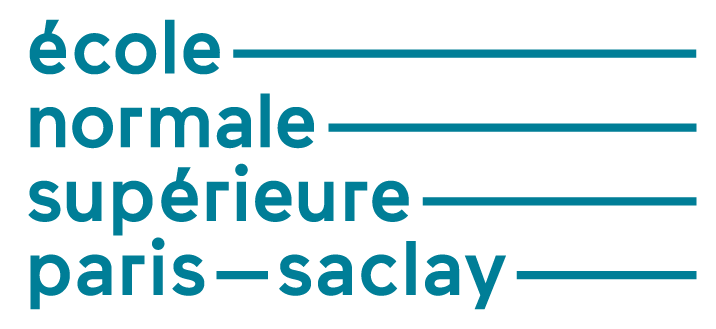
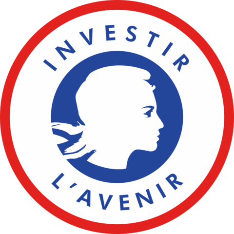

## 3 organismes de recherche
-------------------------

Centre National de la Recherche Scientifique (porteur)

  
Commissariat à l'Énergie Atomique et aux Énergies Alternatives

  
Institut national de recherche en sciences et technologies du numérique

* * *

## 10 universités
--------------

Université de Rennes 1

Université de Rennes 2

Aix-Marseille University

Université de Technologie de Compiègne

  
Université de Lille

Université Grenoble Alpes

  
Université de Strasbourg

COMUE UBFC Université de Technologie Belfort Montbéliard

Université Paris-Saclay

Université de Versailles - Saint-Quentin

* * *

## 9 écoles
--------

Ecole Normale Supérieure de Rennes

Institut National des Sciences Appliquées de Rennes

Ecole Nationale d'Ingénieurs de Brest

 
Ecole Nationale Supérieure Mines-Télécom Atlantique Bretagne-Pays de la Loire

Institut National Polytechnique de Grenoble

Ecole Nationale Supérieure des Arts et Métiers

Télécom Paris - Institut Polytechnique de Paris

Ecole Normale Supérieure Paris-Saclay

CentraleSupélec

* * *

## Financement
-----------

 
Programme Investissements d'avenir

Agence Nationale de la Recherche
